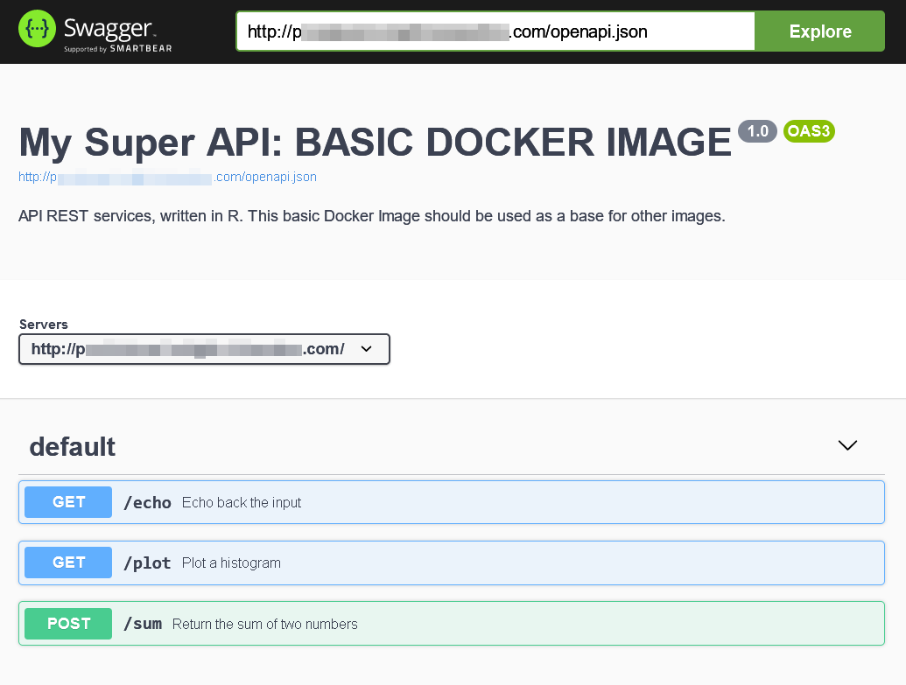
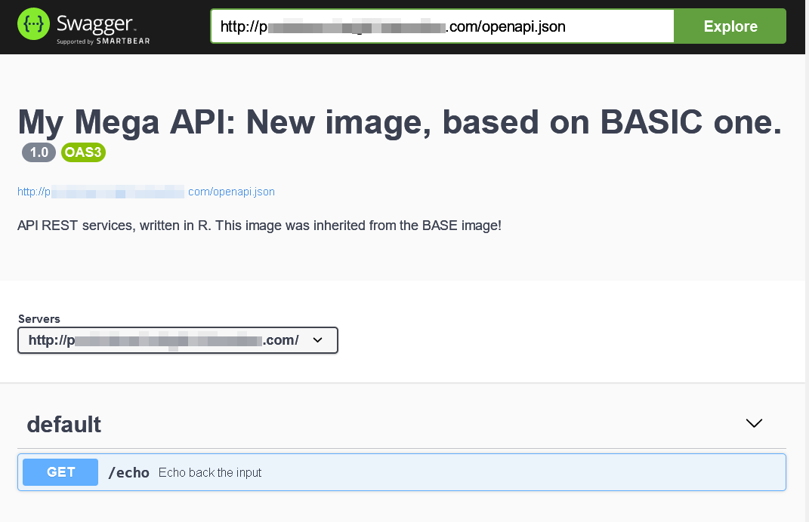

# Azure Function with Swagger UI, written in R


This **Dockerized** R language API demo project provides an easy way to quickly deploy an API to either a local environment or the Azure cloud.

It utilizes **R language** for creating the API and allows for quick scaling and deployment to the cloud for maximum availability.

Additionally, it provides the flexibility of running the API locally, e.g. for local development and testing.

The project uses the popular [Plumber](https://www.rplumber.io) framework to create a [Swagger](https://swagger.io/tools/swagger-ui/) interface. This provides a robust layer of documentation to easily integrate with other applications and services. The included documentation offers an intuitive process for setting up and configuring the API and provides detailed information about the functionality of the API.

It is Linux-based [Docker](https://www.docker.com) to create a containerized environment for the API. This allows for quick deployment to the cloud or local environment.

Linux-based Docker custom image created according the [Microsoft documentation](https://learn.microsoft.com/en-us/azure/azure-functions/functions-create-function-linux-custom-image?pivots=programming-language-other&tabs=in-process%2Cbash%2Cazure-cli&WT.mc_id=aiml-11825-davidsmi).

## Start locally:

Start the API locally:

```bash
docker run -p 80:80 -it emergn/razurefunc:latest
```

Then go to `http://my_host_i_started_container_on/__docs__/` to see the Swagger UI:




## Extend the basic image

To speed up the compilation process, you can inherit from the basic (precompiled) image and add your own code to it.

`Dockerfile` example:

```Dockerfile
FROM emergn/razurefunc:latest

# copy/overwrite file from the current directory into the [basic]container:
COPY services.R /application/services.R
```

Custom `services.R` file example:
```R
library(plumber)

#* @apiTitle My Mega API: New image, based on BASIC one.
#* @apiDescription API REST services, written in R. This image was inherited from the BASE image!
#* @apiVersion 1.0


#* Echo back the input
#* @param msg The message to echo
#* @get /echo
function(msg="") {
  list(msg = paste0("The message is: '", msg, "'"))
}
```
Custom image files can be found in the `/custom` folder of the repository.

Place these 2 files (`Dockerfile` and `services.R`) in a separate folder, then build and run the container:

```bash
docker build -t mymegaapi:latest .

docker run -p 80:80 -it mymegaapi:latest
```

Go to `http://my_host_i_started_container_on/__docs__/` to see the updated custom Swagger UI:




## Start on Azure:

To start the same Docker image as Azure Function App: please, proceed to "Create supporting Azure resources for your function" section of [this Microsoft documentation](https://learn.microsoft.com/en-us/azure/azure-functions/functions-create-function-linux-custom-image?pivots=programming-language-other&tabs=in-process%2Cbash%2Cazure-cli&WT.mc_id=aiml-11825-davidsmi#create-supporting-azure-resources-for-your-function).
