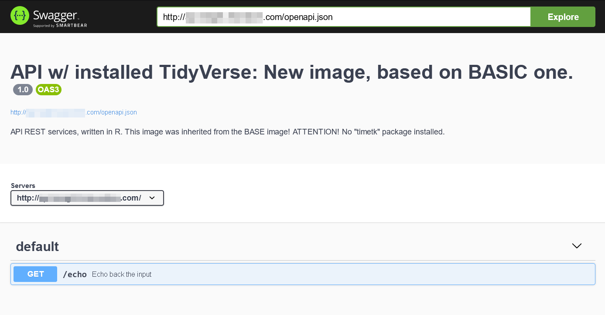

# Tidyverse version

This is special version of *razurefunc* with preinstalled **Tidyverse** packages.

Check the `Dockerfile` which is based on the main version - `FROM emergn/razurefunc:latest`.
Main changes are:

```Dockerfile
RUN apt-get update -qq && apt-get install -y software-properties-common
RUN apt-get update -qq && add-apt-repository ppa:c2d4u.team/c2d4u4.0+
RUN apt-get install -y r-cran-tidyverse
```
We've installed Tidyverse from CRAN repository.

Default started Tidyverse-container should look like this:



Build your own Docker image, based on this one:


```Dockerfile
FROM emergn/razurefunc:tidyverse

[...your code here...]
```

**ATTENTION! There's no "timetk" package here!**

For the image customization, please follow the instructions of the [main repository](https://github.com/divlv/razurefunc) - "Extend the basic image" section, just use `FROM emergn/razurefunc:tidyverse` instead of `FROM emergn/razurefunc:latest` in your `Dockerfile`.
